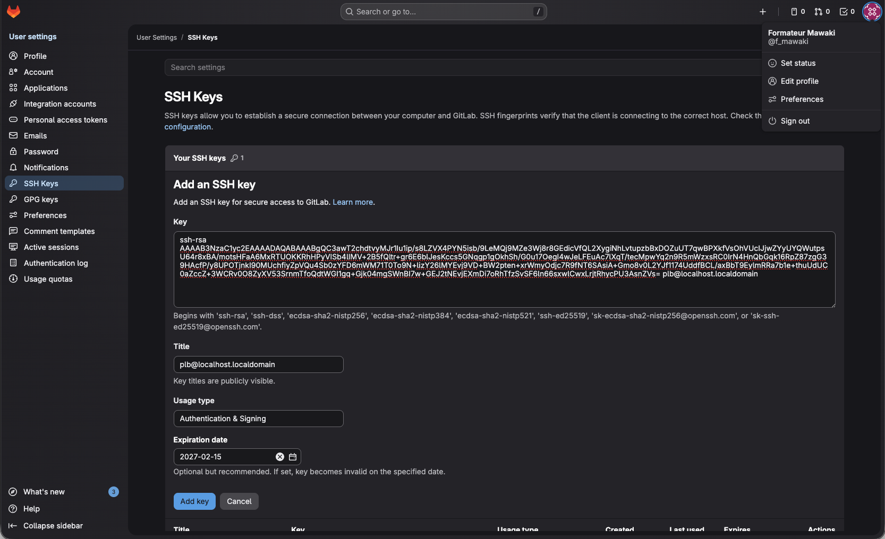
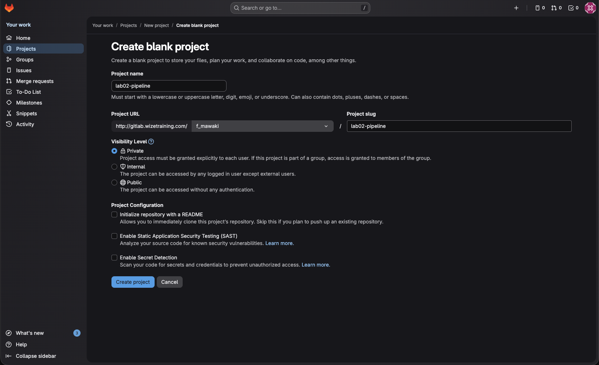
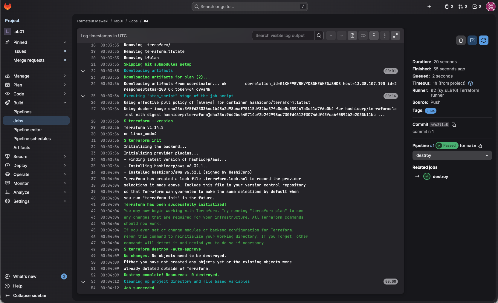
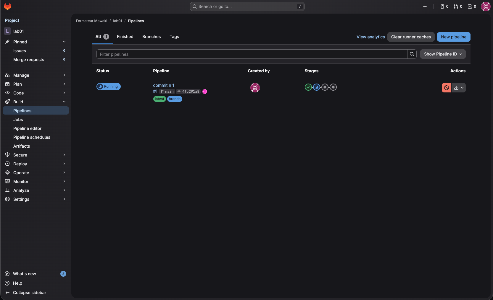
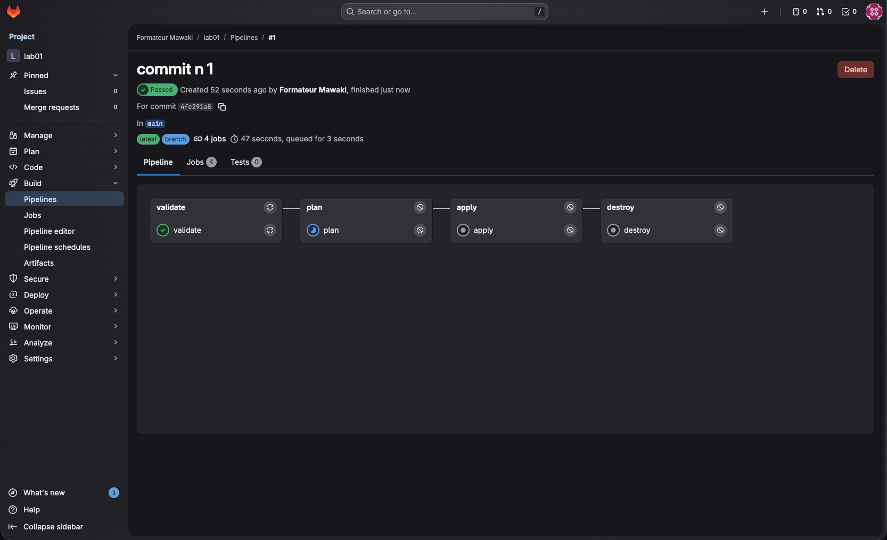

# LAB 02 - "Onboarding" dans l'Usine Logicielle

**Contexte** : L'équipe Sécurité a détecté votre déploiement manuel du Lab 01. C'est une violation de conformité ("Shadow IT"). Vous avez reçu l'ordre de migrer immédiatement ce code dans le pipeline CI/CD sécurisé de la banque.

**Théorie** :

* **GitOps** : Le dépôt Git est l'unique source de vérité
* **Runners** : Ce sont les serveurs qui exécutent le travail (Terraform) à votre place.
* **Secrets** : Les clés AWS ne doivent **jamais** être dans le code (`.tf` ou `.yml`), mais injectées par le CI/CD.

**Objectifs de la Partie 1** :

1. Se connecter à GitLab et Configurer l'accès sécurisé à GitLab (SSH).(accédez à votre compte GitLab sur http://gitlab.wizetraining.com/)
2. Créer le projet dans GitLab.
3. Sécuriser les credentials AWS.
4. Mettre en place le Pipeline et le Backend Distant (State).

---

## Partie 1 : Configuration de l'Environnement CI/CD

Avant de pousser du code, nous devons établir un canal de communication sécurisé entre votre poste et l'usine logicielle GitLab.

### 1. Génération de la clé SSH (Authentification)

Pour interagir avec GitLab sans taper votre mot de passe à chaque `git push`, nous allons utiliser une paire de clés SSH.

1. Ouvrez votre terminal (Git Bash ou Shell).
2. Générez une nouvelle paire de clés (appuyez sur `Entrée` à chaque question pour laisser les valeurs par défaut, **sans passphrase** pour ce lab).

```bash
ssh-keygen
```

3. Affichez votre clé **publique** (le cadenas ouvert) pour la copier :

```bash
cat ~/.ssh/id_rsa.pub

```

4. Copiez tout le contenu (commençant par `ssh-rsa...`).
5. Allez sur GitLab : **Avatar (en haut à droite) Edit Profile SSH Keys**.
6. Collez votre clé dans le champ "Key" et cliquez sur "Add key".



### 2. Création du Projet GitLab

Nous allons créer le conteneur numérique de votre projet.

1. Allez sur la page d'accueil de GitLab.
2. Cliquez sur **"New Project"** **"Create blank project"**.
3. Nommez le projet : `lab02-pipeline`.
4. Laissez la visibilité en **Private**.
5. Décochez "Initialize repository with a README".



### 3. Initialisation Git locale

Transformons votre dossier local en dépôt Git relié à ce nouveau projet.
Avant de transformer votre dossier en dépôt Git, nous devons empêcher certains fichiers sensibles ou temporaires d'être partagés.
1. À la racine du projet `lab01-audit`, créez un fichier nommé `.gitignore`.
2. Copiez le contenu standard pour Terraform :

```text
# .gitignore
.terraform/
*.tfstate
*.tfstate.backup
.terraform.lock.hcl
```

3. Placez-vous dans votre dossier `lab01-audit` (nous réutilisons le code du Lab 1).
2. Initialisez Git et ajoutez la "télécommande" (remote) vers GitLab :

```bash
# Initialiser le dépôt
git init

# Renommer la branche principale en 'main' (standard moderne)
git branch -M main

# Ajouter l'URL de VOTRE projet (Remplacez <VOTRE_USER!)
# Utilisez le lien SSH (git@...) et non HTTPS
git remote add origin git@gitlab.wizetraining.com:<VOTRE_USER>/lab02-pipeline.git

```

### 4. Gestion des Secrets (AWS Keys)

**Règle d'or** : Ne commitez jamais vos clés AWS dans le fichier `.gitlab-ci.yml` ou `variables.tf`. Si vous le faites, des robots scanneront GitHub/GitLab et utiliseront votre compte pour miner des cryptomonnaies en quelques minutes.

Nous allons utiliser les **Variables CI/CD** de GitLab ou des Role IAM sur l'instance EC2 du runner (ce qui est le cas pour nous).

(Vous n'êtes pas obligé de faire ces étapes ci-dessous)
1. Dans votre projet GitLab, allez dans **Settings CI/CD**. 
2. Déroulez la section **Variables**.
3. Ajoutez les deux variables suivantes (Type: Variable, Flags: Masked & Expanded) :
* Clé : `AWS_ACCESS_KEY_ID` | Valeur : `votre_clé_access`
* Clé : `AWS_SECRET_ACCESS_KEY` | Valeur : `votre_clé_secret`


## Partie 2 : Le Pipeline et le Piège du State

C'est ici que nous automatisons le déploiement.

**⚠️ ATTENTION : Transition vers le Pipeline**

Puisque nous passons d'un déploiement manuel (Local) à un déploiement automatisé (GitLab), le Pipeline ne "connaît" pas encore vos ressources existantes. Le pipeline GitLab ne peut pas aspirer le fichier `terraform.tfstate` qui est sur votre PC. Si vous lancez le pipeline maintenant, il essaiera de recréer des ressources qui existent déjà, ce qui provoquera une erreur AWS.
Pour ce Lab, nous allons repartir sur une base saine :

1. Sur votre poste local, détruisez l'infrastructure existante :

```bash
terraform destroy -auto-approve
```

2. Une fois détruit, nous laisserons GitLab reconstruire l'infrastructure proprement. (il existe un moyer de migrer les State Terraform mais ce n'est pas notre Focus pour l'instant)

### 1. Création du Pipeline (`.gitlab-ci.yml`)

À la racine de votre projet, créez le fichier `.gitlab-ci.yml` et collez le contenu ci-dessous.
Ce pipeline définit 4 étapes : Vérification, Planification, Application (manuelle) et Destruction.


<details>
<summary>Voir le fichier .gitlab-ci.yml</summary>

```yaml
# -----------------------------------------------------------------------------
# CONFIGURATION GLOBALE
# -----------------------------------------------------------------------------
default:
  tags:
    - linux # Indique à GitLab d'utiliser un runner (serveur d'exécution) Linux

image:
  name: hashicorp/terraform:latest # On utilise l'image officielle Terraform
  entrypoint: [""] # Astuce technique : écrase le point d'entrée par défaut pour éviter des conflits avec GitLab CI

variables:
  # --- 1. CIBLE AWS ---
  AWS_DEFAULT_REGION: "eu-west-3" # Paris
  AWS_REGION: "eu-west-3"

  # --- 2. LA MAGIE DU BACKEND (STOCKAGE D'ÉTAT) ---
  # Au lieu de configurer le backend S3 dans le fichier .tf, on utilise le backend "http" de GitLab.
  # Terraform détecte automatiquement ces variables commençant par TF_HTTP_*.
  # Cela permet de stocker le fichier "terraform.tfstate" directement dans GitLab, de manière sécurisée.
  TF_HTTP_ADDRESS: ${CI_API_V4_URL}/projects/${CI_PROJECT_ID}/terraform/state/default
  TF_HTTP_LOCK_ADDRESS: ${CI_API_V4_URL}/projects/${CI_PROJECT_ID}/terraform/state/default/lock
  TF_HTTP_UNLOCK_ADDRESS: ${CI_API_V4_URL}/projects/${CI_PROJECT_ID}/terraform/state/default/lock
  
  # Authentification automatique avec le token du job en cours
  TF_HTTP_USERNAME: gitlab-ci-token
  TF_HTTP_PASSWORD: ${CI_JOB_TOKEN} 
  
  # Configuration des verrous (Lock) pour empêcher deux déploiements simultanés
  TF_HTTP_LOCK_METHOD: POST
  TF_HTTP_UNLOCK_METHOD: DELETE
  TF_HTTP_RETRY_WAIT_MIN: 5

# --- OPTIMISATION ---
# Sauvegarde le dossier .terraform pour éviter de retélécharger les plugins AWS à chaque étape
cache:
  key: default
  paths:
    - .terraform

# --- PRÉPARATION ---
# Commandes lancées avant CHAQUE job (validate, plan, apply...)
before_script:
  - terraform --version
  - terraform init -reconfigure # Initialise Terraform avec la config backend définie dans les variables

stages:
  - validate
  - plan
  - apply
  - destroy

# -----------------------------------------------------------------------------
# LES ÉTAPES DU PIPELINE
# -----------------------------------------------------------------------------

validate:
  stage: validate
  script:
    - terraform validate # Vérifie juste la syntaxe du code

plan:
  stage: plan
  script:
    # Crée le plan d'exécution et le sauvegarde dans un fichier binaire "tfplan"
    - terraform plan -out=tfplan
  artifacts:
    # L'artefact est crucial : il transmet le fichier "tfplan" à l'étape suivante.
    # Cela garantit qu'on applique EXACTEMENT ce qu'on a validé ici.
    paths:
      - tfplan

apply:
  stage: apply
  script:
    # Applique le fichier "tfplan" reçu de l'étape précédente.
    # Plus de surprise : on exécute ce qui a été calculé dans le "plan".
    - terraform apply -auto-approve tfplan
  when: manual # Sécurité : nécessite un clic humain pour lancer le déploiement en Prod

destroy:
  stage: destroy
  script:
    - terraform destroy -auto-approve
  when: manual # Sécurité absolue : nécessite un clic humain pour tout supprimer
```

</details>

### 2. Configuration du Backend dans Terraform (`main.tf`)

Pour que le pipeline ci-dessus fonctionne, vous devez dire à Terraform : "Arrête d'utiliser le fichier local, prépare-toi à recevoir une configuration HTTP".

Voir la liste des Backend supportés : https://developer.hashicorp.com/terraform/language/backend

Modifiez votre fichier `main.tf` (ou `providers.tf`) pour ajouter ce bloc dans `terraform { ... }` :

```hcl
terraform {
  required_providers {
    aws = {
      source  = "hashicorp/aws"
      version = "~>6.0"
    }
  }
  required_version = ">= 1.14.0"
  
  # --- AJOUT CRITIQUE POUR LAB 02 ---
  # On délègue le stockage du state au backend HTTP configuré par le CI/CD
  backend "http" {} 
  # ----------------------------------
}

```

### 3. Pourquoi cette configuration est critique ?

Sans la configuration `backend "http"` et les variables dans le `.gitlab-ci.yml`, Terraform stockerait le state **localement dans le conteneur Docker du Runner**.

Voici ce qui se passe sur le serveur GitLab lors de l'exécution :

```bash
# Pas de conteneur lancé tant qu'il n'y pas de jobs
ubuntu@gitlab-instance:~$ sudo docker ps -a
CONTAINER ID   IMAGE     COMMAND   CREATED   STATUS    PORTS     NAMES

# Des conteneurs lancés lorsqu'un job est lancé
ubuntu@gitlab-instance:~$ sudo docker ps -a
CONTAINER ID   IMAGE          COMMAND                  CREATED          STATUS                      PORTS     NAMES
f18333183b53   3f5fd350366c   "sh -c 'if [ -x /usr…"   19 seconds ago   Up 18 seconds                         runner-2fyj2rpzx-project-1-concurrent-0-bdb8765fb73c6c15-build
0208f4582934   7b160f41d234   "/usr/bin/dumb-init …"   21 seconds ago   Exited (0) 19 seconds ago             runner-2fyj2rpzx-project-1-concurrent-0-bdb8765fb73c6c15-predefined

# Les conteneurs sont supprimés une fois le Job terminé
ubuntu@gitlab-instance:~$ sudo docker ps -a
CONTAINER ID   IMAGE     COMMAND   CREATED   STATUS    PORTS     NAMES
```

**🚨 Le Danger :**

1. Le job `apply` crée l'infrastructure et écrit le fichier `terraform.tfstate` dans le conteneur.
2. Le job termine, **le conteneur est détruit**.
3. **Le fichier State est perdu.** Terraform a oublié qu'il a créé des ressources.

Alors, lors du destroy par exemple ou lors d'une modification de l'infastructure, Terraform ne trouve rien à détruire :



---

## Partie 3 : Déploiement vers l'Usine

### Pipeline et jobs

Il est temps d'envoyer votre code. À partir de maintenant, **interdiction d'utiliser la commande `terraform apply` sur votre poste !**

1. Ajoutez, commitez et poussez vos fichiers :

```bash
git add .
git commit -m "Migration vers GitLab CI avec Backend HTTP"
git push -u origin main

```

2. Allez sur GitLab dans le menu **Build Pipelines**.
3. Vous verrez votre pipeline s'exécuter.
4. Cliquez sur le statut du pipeline pour voir le détail des jobs. Le job `apply` sera en attente (manuel).
5. Cliquez sur le bouton "Play" (lecture) du job `apply` pour lancer le déploiement sur AWS.
6. Si tout est vert, cliquez sur le job pour voir les logs et récupérer l'IP publique dans les outputs.

---

### Où trouver le "State" et comprendre le "Lock"

Puisque nous utilisons le backend HTTP de GitLab, le fichier `terraform.tfstate` n'est pas sur votre ordinateur, mais stocké de manière sécurisée dans GitLab.

#### 1. Visualiser le fichier d'état

Pour voir l'état actuel de votre infrastructure :

1. Dans le menu de gauche de votre projet GitLab, allez dans **Operate** **Terraform states**.
2. Vous verrez une ligne nommée `default`.
3. Cliquez sur les trois petits points (⋮) **Download JSON** pour voir à quoi ressemble la mémoire de Terraform.

#### 2. Le mécanisme de Verrouillage (Lock) 🔐

C'est un concept critique en équipe.

* **Quand ça arrive :** Dès que le job `plan` ou `apply` démarre dans le pipeline.
* **Ce que l'on voit :** Un petit icône de cadenas (🔒 **Locked**) apparaît à côté du state `default` dans l'interface GitLab.
* **Pourquoi ?** C'est une sécurité absolue. Cela empêche deux personnes (ou deux pipelines) de modifier l'infrastructure **en même temps**, ce qui corromprait le fichier d'état.
* **Analogie :** C'est comme les sanitaires publics. Quand quelqu'un est dedans (Job en cours), le voyant passe au rouge (Lock). Personne d'autre ne peut entrer tant que la personne n'a pas fini.


## Partie 4 : Mise à jour de l'infrastructure

 Vous avez déployé l'instance, mais impossible de vous y connecter ! Vous avez oublié d'injecter votre clé SSH publique (`id_rsa.pub`) dans AWS. Sans cela, AWS refuse toute connexion, même si le Security Group est ouvert.

**Votre tâche :**
1. Copiez votre clé publique à la racine du projet pour que GitLab puisse la lire :

```
cp ~/.ssh/id_rsa.pub ./my_key.pub
```

2. Modifiez le fichier `main.tf` pour :
* Créer une ressource `aws_key_pair` (Voir [la Documentation](https://registry.terraform.io/providers/hashicorp/aws/latest/docs/resources/key_pair)) qui lit ce fichier `my_key.pub`.
* Associer cette clé à votre instance `aws_instance` via l'attribut `key_name`.

> **Astuce :** Il faut utiliser [la fonction `file()` (voir documentation)](https://developer.hashicorp.com/terraform/language/functions/file) et aussi [path.module (voir documentation)](https://developer.hashicorp.com/terraform/language/expressions/references#path-module). C'est la solution portable : En copiant la clé dans le dossier du projet (`./my_key.pub`) et en utilisant `${path.module}`, nous rendons le code portable.
> * `${path.module}` est une variable Terraform qui signifie : _"Le dossier où se trouve actuellement ce fichier main.tf"_.
> * Que Terraform s'exécute sur votre PC, sur un serveur à Paris ou dans un conteneur Docker GitLab, il trouvera toujours le fichier `my_key.pub` car il voyage avec le code Git.


3. Commitez et Pushez.

4. **Observez le Lock :** Pendant que le pipeline tourne, allez vite voir dans **Operate Terraform states**. Vous verrez le statut **"Locked"**. C'est le moment d'essayer de lancer un `terraform plan` en local pour voir qu'il est bloqué !


<details>
<summary>Correction nouveau main.tf</summary>

Voici les modifications à apporter au fichier `main.tf`.

**Attention au piège CI/CD :** On ne peut pas utiliser `file("~/.ssh/id_rsa.pub")` directement dans le code, car le Runner GitLab (le serveur qui exécute le code) n'a pas accès au dossier personnel de l'étudiant ! C'est pour cela qu'il faut copier la clé dans un fichier local du projet (ex: `my_key.pub`) avant de l'envoyer.

Voici le `main.tf` corrigé :

```hcl
# main.tf

# --- AJOUT : Ressource Key Pair ---
# Cette ressource envoie la clé publique vers AWS

resource "aws_key_pair" "audit_key" {
  # On donne un nom unique à la clé sur AWS
  key_name   = "${var.project_name}-key"
  
  # On lit le contenu du fichier copié à la racine du projet
  # Note : Assurez-vous d'avoir fait 'cp ~/.ssh/id_rsa.pub my_key.pub' avant !
  public_key = file("${path.module}/my_key.pub")
}

# 1. Le Security Group (Inchangé)
resource "aws_security_group" "audit_sg" {
  name        = "${var.project_name}-sg"
  description = "Allow SSH for Auditor"

  ingress {
    from_port   = 22
    to_port     = 22
    protocol    = "tcp"
    cidr_blocks = [var.auditor_ip]
  }

  egress {
    from_port   = 0
    to_port     = 0
    protocol    = "-1"
    cidr_blocks = ["0.0.0.0/0"]
  }

  tags = {
    Name = "${var.project_name}-sg"
  }
}

# 2. L'instance EC2 (Modifiée)
resource "aws_instance" "audit_vm" {
  ami             = var.ami_id
  instance_type   = var.instance_type
  
  # --- MODIFICATION : Liaison avec la Key Pair ---
  # On dit à l'instance d'utiliser la clé définie plus haut
  key_name = aws_key_pair.audit_key.key_name
  
  vpc_security_group_ids = [aws_security_group.audit_sg.id]

  tags = {
    Name        = "${var.project_name}-vm"
    Environment = "Audit"
    Owner       = "SecuTeam"
  }
}

```

</details>

5. Testez la connection à na nouvelle instance
* regarder les logs du Job Apply et identifier l'adresse IP public
* testez avec `ssh ubuntu@<IP_PUBLIQUE>`

### Ce qui va se passer :

1. **Modification Majeure :** Ajouter `key_name` à une instance EC2 est une action destructive pour AWS (dans la plupart des cas, cela force le remplacement de l'instance).
2. **Temps d'exécution :** Terraform va devoir détruire l'ancienne VM et en créer une nouvelle. Cela prendra environ 1 à 2 minutes.
3. **L'opportunité du Lock :** C'est durant ces 2 minutes précieuses que le fichier d'état sera **Verrouillé (Locked)** par le Pipeline. Si vous essayez de lancer une commande Terraform en local à ce moment précis, il recevra une erreur `Error: Error acquiring the state lock`, prouvant que le mécanisme de sécurité fonctionne.

---

⚠️ **Note importante :** Si un pipeline plante ou est annulé brutalement, le State peut rester "bloqué" (Locked). Dans ce cas (et seulement dans ce cas), vous pouvez cliquer sur "Unlock" manuellement dans l'interface GitLab pour débloquer la situation.

**Bravo !** Vous êtes passé en mode "GitOps". C'est GitLab qui a les clés du camion, plus vous.





---

## Solution finale

Vous pouvez télécharger le code de la solution prêt à être déployé ici : 

```bash
git clone https://github.com/wizetraining/terraform-correction.git
```