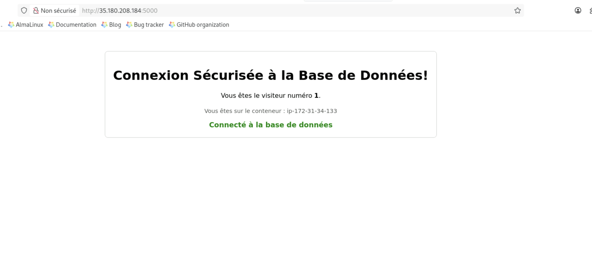

# LAB 08 - Architecture 2-Tiers & Secrets Dynamiques (App CountVisit)

**Contexte** :
Vous devez déployer une application composée de deux services distincts :

1. **Redis (Database)** : Stocke le nombre de visites. Il doit être sécurisé par un mot de passe.
2. **Webapp (Frontend)** : Une application Python Flask qui affiche le compteur.

**Voici le code l'application Web**

<details>
<summary>Voir le code Ici : </summary>

```python
# Contenu de app.py
import time
import redis
import socket
from flask import Flask, request
import logging

# Configuration du logging standard pour une sortie propre
logging.basicConfig(level=logging.INFO, format='%(asctime)s - %(name)s - %(levelname)s - %(message)s')

app = Flask(__name__)

# --- GESTION DES SECRETS ---
# On lit le mot de passe Redis depuis le fichier /etc/app/secrets/redis_password
try:
    with open('/etc/app/secrets/redis_password', 'r') as secret_file:
        redis_password = secret_file.read().strip()
    app.logger.info("Mot de passe Redis chargé avec succès.")
except IOError:
    # Fallback si le secret n'est pas trouvé
    redis_password = None
    app.logger.warning("Secret 'redis_password' non trouvé. Tentative de connexion sans mot de passe.")

# On se connecte au service 'redis' avec le mot de passe
cache = redis.Redis(host='<IP_SERVEUR_REDIS>', port=6379, password=redis_password, decode_responses=True)

def get_hit_count():
    """
    Tente de se connecter à Redis et d'incrémenter le compteur.
    Gère les erreurs de connexion et d'authentification.
    """
    retries = 5
    while True:
        try:
            # Tente de vérifier la connexion avant d'incrémenter
            cache.ping()
            return cache.incr('hits')
        except redis.exceptions.ResponseError as exc:
            # Ceci interceptera les erreurs d'authentification
            app.logger.error(f"Erreur d'authentification Redis: {exc}")
            return "Erreur d'authentification"
        except redis.exceptions.ConnectionError as exc:
            if retries == 0:
                raise exc
            retries -= 1
            app.logger.warning(f"Connexion à Redis échouée. Nouvelle tentative dans 0.5s... ({retries} restantes)")
            time.sleep(0.5)

@app.route('/')
def hello():
    db_status_message = ''
    count = 0
    try:
        count = get_hit_count()
        # On vérifie si le compteur est un nombre (succès) ou un message d'erreur
        if isinstance(count, int):
            db_status_message = '<strong style="color:green;">Connecté à la base de données</strong>'
            # On log chaque visite réussie
            app.logger.info(f"Visite N°{count} depuis l'IP {request.remote_addr}")
        else:
             # Affiche le message d'erreur (ex: Erreur d'authentification)
             db_status_message = f'<span style="color:orange;">{count}</span>'
    except redis.exceptions.ConnectionError:
        count = 'N/A'
        db_status_message = '<span style="color:red;">Echec de connexion à la base de données</span>'
        app.logger.error(f"Echec de connexion à Redis depuis l'IP {request.remote_addr}")

    # Récupérer le nom d'hôte du conteneur
    hostname = socket.gethostname()

    # Construire le HTML de la réponse
    html_response = f"""
    <!DOCTYPE html>
    <html lang="fr">
    <head>
        <meta charset="UTF-8">
        <meta name="viewport" content="width=device-width, initial-scale=1.0">
        <title>Compteur de Visites Sécurisé</title>
        <style>
            body {{ font-family: sans-serif; text-align: center; margin-top: 50px; }}
            .container {{ padding: 20px; border: 1px solid #ccc; border-radius: 8px; display: inline-block; }}
            .hostname {{ font-size: 0.9em; color: #555; margin-top: 20px; }}
            .db-status {{ margin-top: 15px; font-size: 1.1em; }}
        </style>
    </head>
    <body>
        <div class="container">
            <h1>Connexion Sécurisée à la Base de Données!</h1>
            <p>Vous êtes le visiteur numéro <strong>{count}</strong>.</p>
            <div class="hostname">Vous êtes sur le conteneur : {hostname}</div>
            <div class="db-status">{db_status_message}</div>
        </div>
    </body>
    </html>
    """
    return html_response

if __name__ == "__main__":
    app.run(host="0.0.0.0", port=5000, debug=True)

```

</details>

**Le Défi** :

* Le serveur Web doit connaître l'IP du serveur Redis (qui n'existe pas encore !).
* Le serveur Web doit connaître le mot de passe Redis (qui est sécurisé dans Vault).
* Le serveur Redis doit démarrer avec ce même mot de passe.
* **Aucun secret ni IP ne doit être écrit en dur dans le code.**

---

## Partie 1 : Création du Secret Redis (Vault)

Avant de toucher à Terraform, définissons le mot de passe que les deux serveurs partageront.

1. Accédez à votre Vault : `http://vault.wizetraining.com:8200` => token : `hvs.F066Sx6TQ8JHyiMgwEGGTfQe`
2. Allez dans le moteur `kv`.
3. Créez un nouveau secret :
* **Path** : `kv/<VOTRE_PRENOM>/countvisit/redis`
* **Key** : `password`
* **Value** : `UnMotDePasseTresComplique2026!`
4. Sauvegardez.

---

## Partie 2 : Le Code Terraform

Nous allons créer 2 instances. L'une dépend de l'autre (la Webapp a besoin de l'IP de Redis).

### 1. `providers.tf` (Inchangé ou presque)

Assurez-vous d'avoir le provider Vault configuré.

<details>
<summary>Correction providers.tf</summary>

```hcl
terraform {
  required_providers {
    aws   = { source = "hashicorp/aws", version = "~> 6.0" }
    vault = { source = "hashicorp/vault", version = "~> 3.0" }
  }
}

provider "aws" { region = "eu-west-3" }

provider "vault" {
  address = "http://vault.wizetraining.com:8200"
  token   = "xxx"          # Token Etudiant
}
```

</details>

### 2. `secrets.tf` (Récupération)

On récupère le mot de passe depuis Vault pour pouvoir l'injecter.

<details>
<summary>Correction secrets.tf</summary>

```hcl
# secrets.tf

# ⚠️ REMPLACEZ <VOTRE_PRENOM> CI-DESSOUS !
data "vault_generic_secret" "redis_secret" {
  path = "kv/<VOTRE_PRENOM>/countvisit/redis"
}

```

</details>

### 3. `security.tf` (Réseau)

Il nous faut ouvrir les ports 5000 (Web) et 6379 (Redis).

<details>
<summary>Correction security.tf</summary>

```hcl
# security.tf

# SG pour l'application Web (Port 5000 ouvert au monde)
resource "aws_security_group" "webapp_sg" {
  name = "countvisit-webapp-sg"
  ingress {
    from_port   = 5000
    to_port     = 5000
    protocol    = "tcp"
    cidr_blocks = ["0.0.0.0/0"]
  }
  ingress { # SSH pour debug
    from_port   = 22
    to_port     = 22
    protocol    = "tcp"
    cidr_blocks = ["0.0.0.0/0"]
  }
  egress {
    from_port   = 0
    to_port     = 0
    protocol    = "-1"
    cidr_blocks = ["0.0.0.0/0"]
  }
}

# SG pour Redis (Port 6379)
resource "aws_security_group" "redis_sg" {
  name = "countvisit-redis-sg"
  ingress {
    from_port   = 6379
    to_port     = 6379
    protocol    = "tcp"
    cidr_blocks = ["0.0.0.0/0"]
  }
  ingress { # SSH pour debug
    from_port   = 22
    to_port     = 22
    protocol    = "tcp"
    cidr_blocks = ["0.0.0.0/0"]
  }
  egress {
    from_port   = 0
    to_port     = 0
    protocol    = "-1"
    cidr_blocks = ["0.0.0.0/0"]
  }
}

```

</details>


### 4. `main.tf` (Les Instances & Configuration)

Cette étape est cruciale : c'est ici que l'infrastructure rencontre le code applicatif.

#### 4.1. Préparation du Template Applicatif (`app.py`)

Terraform doit injecter l'IP de Redis dans le code Python. Pour cela, nous allons utiliser un **template**.

* Créez un fichier nommé `app.py` à la racine du projet (au même niveau que `main.tf`).
* Copiez le code Python de la **Partie 0** dedans.
* **Vérifiez bien cette ligne** dans le fichier :

```python
# C'est ce placeholder que Terraform va remplacer !
REDIS_HOST = '${redis_ip}'

```

#### 4.2. Instance 1 : Le Serveur Redis

Définissez la ressource `aws_instance` pour Redis. Son rôle est de s'installer, de récupérer le mot de passe depuis Vault, et de se configurer pour accepter les connexions externes.

**Ce que doit contenir votre `user_data` :**

1. Installation de `redis-server`.
2. Modification de la config pour écouter sur `0.0.0.0` (commande `sed`).
3. Récupération du secret Vault via la variable Terraform `${data.vault_generic_secret...}`.
4. Redémarrage sécurisé de Redis.

<details>
<summary>💡 Indice pour le User Data Redis</summary>

```bash
#!/bin/bash
apt-get update -y && apt-get install -y redis-server

# 1. Autoriser les connexions externes
sed -i 's/bind 127.0.0.1 ::1/bind 0.0.0.0/' /etc/redis/redis.conf

# 2. Récupérer le mot de passe (Injection Terraform)
REDIS_PASS="${data.vault_generic_secret.redis_secret.data["password"]}"

# 3. Relancer Redis avec le mot de passe
systemctl stop redis
redis-server --daemonize yes --requirepass $REDIS_PASS --bind 0.0.0.0 --protected-mode no

```

</details>

#### 4.3. Instance 2 : Le Serveur Webapp

Définissez la ressource `aws_instance` pour le Web. C'est ici que la magie de **`templatefile`** opère.

**Ce que doit faire votre `user_data` :**

1. Installer les dépendances (`python3-pip`, `flask`, `redis`).
2. Écrire le secret Vault dans un fichier `/etc/app/secrets/redis_password`.
3. **Générer le fichier `app.py` final** en utilisant le template local et en injectant l'IP publique de Redis.

<details>
<summary>💡 Indice pour le Templatefile (La partie difficile)</summary>

Utilisez cette syntaxe précise dans votre `user_data` pour générer le fichier Python :

```bash
# ... installation des paquets avant ...

# On utilise 'cat' avec un délimiteur (PYTHON_EOF) pour écrire le fichier.
# Terraform va lire votre fichier local app.py, remplacer ${redis_ip}
# par l'IP réelle de la machine Redis, et écrire le résultat sur le serveur.

cat <<"PYTHON_EOF" > /home/ubuntu/app.py
${templatefile("${path.module}/app.py", {
  redis_ip = aws_instance.redis_vm.public_ip
})}
PYTHON_EOF

# ... lancement du script python après ...

```

</details>

**⚠️ Important :** N'oubliez pas d'ajouter `depends_on = [aws_instance.redis_vm]` dans la ressource Webapp. Terraform doit savoir qu'il faut créer Redis *avant* pour connaître son adresse IP !


## Partie 3 : Déploiement et Test

1. **Valider et Appliquer :**
```bash
terraform init
terraform apply -auto-approve

```
</details>


*Regardez bien le plan : Terraform va lire le secret Vault et calculer l'ordre de création (Redis d'abord, puis Webapp).*
2. **Tester l'application :**
* Récupérez l'IP publique de la Webapp (dans la console AWS ou via un `output` si vous en ajoutez un).
* Ouvrez votre navigateur : `http://<IP_WEBAPP>:5000`

3. **Résultat attendu :**
* Une page blanche s'affiche.
* Le compteur de visite est à **1**.
* Rafraîchissez la page : le compteur passe à **2**, **3**, etc.
* Le statut doit être **"Connecté (Redis sécurisé)"**.



---

### 🔍 Debugging (Si ça ne marche pas)

Si vous voyez "Erreur Connexion" :

1. Vérifiez que le **Security Group Redis** autorise bien le port 6379 depuis n'importe où (ou depuis l'IP de la Webapp).
2. Connectez-vous en SSH sur la Webapp et vérifiez le fichier de secret :
```bash
cat /etc/app/secrets/redis_password

```

*Est-ce bien le mot de passe que vous avez mis dans Vault ?*
3. Vérifiez que l'IP de Redis a bien été injectée dans le code Python :
```bash
grep "REDIS_HOST =" /home/ubuntu/app.py
```

4. Vous pouvez consulter les logs d'éxécution du script d'installation

```bash
cat /var/log/cloud-init-output.log
cat /var/log/user-data.log
```

regardez le journal d'erreur de l'application même

```bash
cat /home/ubuntu/app.log
```

Test depuis le serveur Redis

```
ps aux | grep redis
# Pour voir le mot de passe utilisé par le processus en cours
ps aux | grep requirepass
redis-cli -h 127.0.0.1 -p 6379 -a <VOTRE_MOT_DE_PASSE>
```


### 🧹 Nettoyage

Une fois le Lab terminé, n'oubliez pas d'éteindre pour économiser :

```bash
terraform destroy -auto-approve

```

---

## Solution finale

Vous pouvez télécharger le code de la solution prêt à être déployé ici :

```bash
git clone https://github.com/wizetraining/terraform-correction.git

```